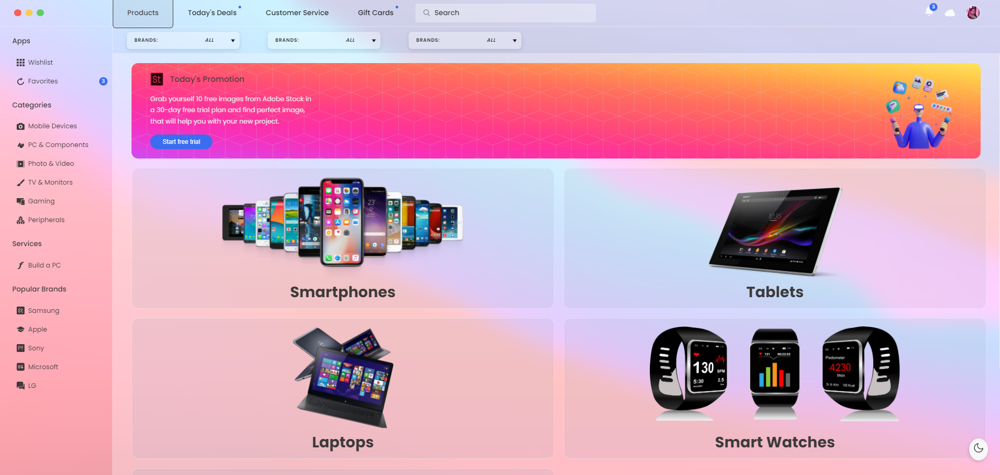
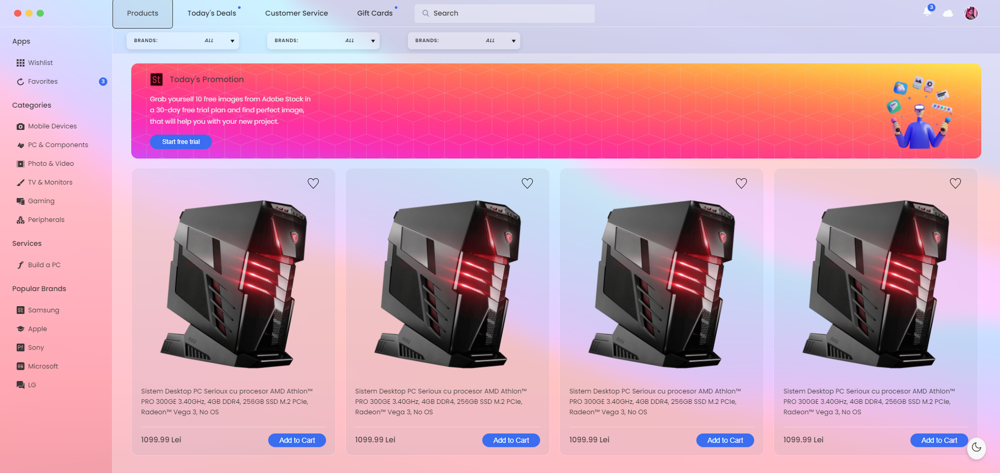

# Shop

## Introduction
Shop is an online shop, where people can buy electronic products.

#Technologies:
##Frontend
Javascript, HTML, CSS, React, Bootstrap

##Backend
ASP NET Core, C#, Entity Framework, Microsoft SQL Server, MVC Pattern, Swagger v2

##Features

- React Functional components and their reusability
- React file and folder structure
- Fundamental CSS properties to master flex & grid
- Fundamentals of the CSS BEM Model
- From soft and pleasant animations to complex gradients
- Perfectly placed media queries for satisfactory responsiveness covering almost devices
- Animations
- Complex Sorting and Ordering
- Intuitive UX
- Glassmorphism UI Theme
- Searchbar
- Notifications
- Profile
- Checkout
- Dark and Light mode
- Responsive
- Scalable

##Preview

